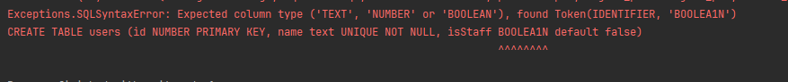
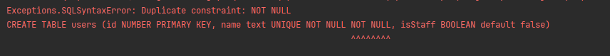
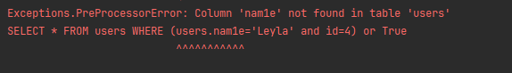

# RegretDB – A Mock Relational Database Engine

RegretDB is a **mock relational database engine** written in Python. 
It implements a full custom SQL parser, an Abstract Syntax Tree (AST) with semantic validation, 
a query planner, an execution engine, and an in‑memory storage layer with constraint enforcement. 

The goal was to understand how parsers work and also make the implementation clean and extensible.

I was also inspired by the respectfully shity error reporting in oracle during SQL parsing. So I wanted to make a better one!

## Features

- **SQL Parsing** – Handles `CREATE TABLE`, `DROP TABLE`, `SELECT`, `INSERT`, `UPDATE`, `DELETE`, and `ALTER` (partial).
- **Rich Data Types** – `INTEGER`, `TEXT`, `BOOLEAN`, `NULL`.
- **Constraints** – `NOT NULL`, `UNIQUE`, `PRIMARY KEY`, `FOREIGN KEY`, `DEFAULT`.
- **Foreign Key Actions** – `RESTRICT`, `CASCADE`, `SET NULL` (on `DELETE` and `UPDATE`).
- **WHERE Expressions** – `AND`, `OR`, `NOT`, comparisons (`=`, `!=`, `<`, `>`, `<=`, `>=`), `IS NULL` / `IS NOT NULL`, `Like` and `Between`.
- **Query Execution** – Table scan, filter, projection, sorting etc.
- **Error Reporting** – Precise syntax errors with caret underlining and descriptive semantic errors.
- **In‑Memory Storage** 
